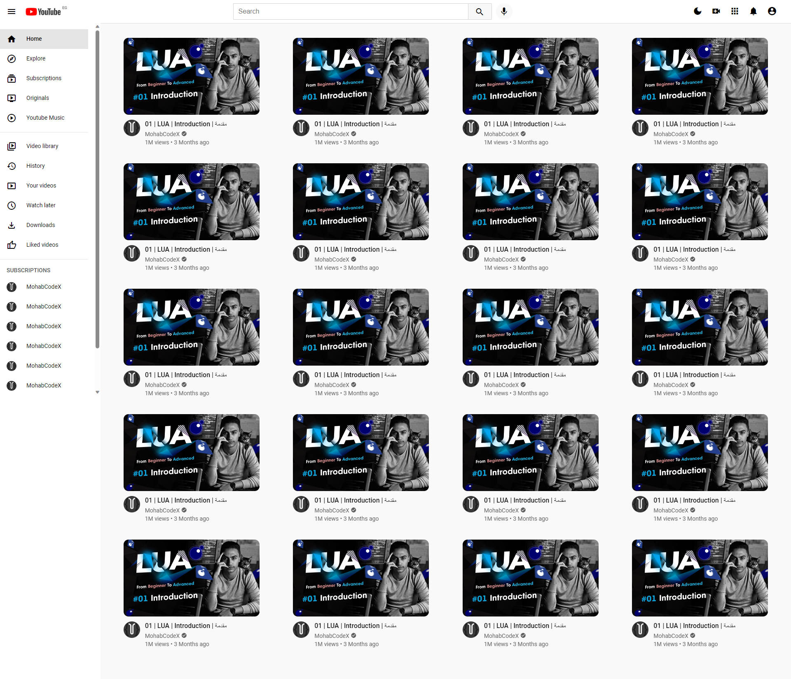
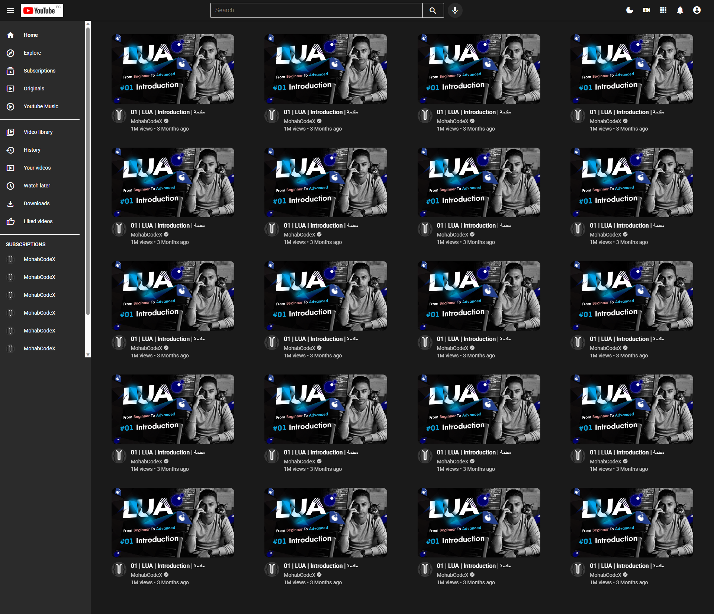

# YouTube Clone Project

This project is a YouTube clone that replicates some of the basic functionalities and design elements of the popular video-sharing platform, YouTube. It is built using HTML, CSS, and JavaScript.

## Features

- **Responsive Design**: The web application is designed to be responsive and can be viewed on various devices, including desktops, tablets, and mobile phones.

- **Dark Mode**: Users can switch between light and dark modes to suit their preferences. This feature enhances the user experience, especially in low-light environments.

- **Search Functionality**: Users can search for videos using the search bar. The search results are displayed dynamically without the need for a page reload.

- **Video Thumbnails**: Videos are displayed with thumbnails, providing users with a visual preview of the content.

- **Video Details**: Each video displays its title, creator, and an optional verification badge for authenticated creators.

- **Navigation Sidebar**: Users can navigate between different sections using the sidebar, which includes links to Home, Trending, Subscriptions, and Library.

- **Trending Videos**: A section for trending videos allows users to discover popular content.

- **Subscription Feed**: Authenticated users can access a feed containing videos from channels they are subscribed to.

## Getting Started

To run this project locally, follow these steps:

1. **Clone the Repository**: 
- git clone https://github.com/username/youtube-clone.git

2. **Open in Browser**:
- Navigate to the project directory and open `index.html` in your preferred web browser.

3. **Explore**:
- Interact with the YouTube clone and explore its features.

## Usage

- Use the search bar to find videos based on keywords.
- Click on a video thumbnail to view its details and watch the video.
- Toggle between light and dark modes using the theme switcher in the header.

## Contributing

Contributions are welcome! If you'd like to contribute to this project, please follow these steps:

1. Fork the repository.
2. Create a new branch for your feature or bug fix.
3. Make the necessary changes.
4. Open a pull request with a detailed description of the changes.

## License

This project is licensed under the [MIT License](LICENSE).

## Acknowledgements

- This project was inspired by the YouTube platform.
- Special thanks to [OpenAI](https://openai.com/) for providing the assistance of ChatGPT in generating this README.

---

Feel free to customize this README to include any additional information about your project or specific instructions for developers. Good luck with your YouTube clone project!

# مشروع نسخة من يوتيوب

هذا المشروع هو نسخة مشابهة ليوتيوب، حيث يقوم بتقليد بعض الوظائف وعناصر التصميم الأساسية لمنصة مشاركة الفيديو الشهيرة يوتيوب. تم بناؤه باستخدام HTML و CSS و JavaScript.

## المميزات

- **تصميم متجاوب**: تم تصميم تطبيق الويب ليكون متجاوباً ويمكن عرضه على مختلف الأجهزة، بما في ذلك أجهزة الكمبيوتر المكتبي والأجهزة اللوحية والهواتف المحمولة.

- **وضع الظلام**: يمكن للمستخدمين التبديل بين وضعيات النمط الفاتح والداكن حسب تفضيلاتهم. تتيح هذه الميزة تحسين تجربة المستخدم، خاصة في البيئات ذات الإضاءة المنخفضة.

- **وظيفة البحث**: يستطيع المستخدمون البحث عن مقاطع الفيديو باستخدام شريط البحث. تظهر نتائج البحث ديناميكياً دون الحاجة إلى إعادة تحميل الصفحة.

- **صور مصغرة للفيديو**: يتم عرض مقاطع الفيديو بصور مصغرة، مما يوفر للمستخدمين معاينة بصرية للمحتوى.

- **تفاصيل الفيديو**: يعرض كل فيديو عنوانه ومُنشئه، بالإضافة إلى شارة التحقق الاختيارية للمُنشئ الموثق.

- **شريط التنقل الجانبي**: يمكن للمستخدمين التنقل بين مختلف الأقسام باستخدام الشريط الجانبي، الذي يتضمن روابط إلى الصفحات الرئيسية والشائعة والاشتراكات والمكتبة.

- **مقاطع الفيديو الشائعة**: يوجد قسم خاص لمقاطع الفيديو الشائعة يتيح للمستخدمين استكشاف المحتوى الرائج.

- **تغذية الاشتراكات**: يمكن للمستخدمين المُوثقين الوصول إلى تغذية تحتوي على مقاطع فيديو من القنوات التي اشتركوا فيها.

## كيفية البدء

لتشغيل هذا المشروع محلياً، اتبع الخطوات التالية:

1. **استنساخ المستودع**: 
- git clone https://github.com/username/youtube-clone.git

2. **فتح في المتصفح**:
- انتقل إلى دليل المشروع وافتح `index.html` في متصفح الويب الخاص بك.

3. **استكشاف**:
- تفاعل مع نسخة يوتيوب واستكشف ميزاتها.

## الاستخدام

- استخدم شريط البحث للعثور على مقاطع فيديو بناءً على الكلمات الرئيسية.
- انقر فوق صورة مصغرة للفيديو لعرض تفاصيله ومشاهدة الفيديو.
- قم بتبديل بين وضعيات النمط الفاتح والداكن باستخدام مفتاح التبديل في الهيدر.

## المساهمة

المساهمات مرحب بها! إذا كنت ترغب في المساهمة في هذا المشروع، يرجى اتباع الخطوات التالية:

1. انسخ المستودع.
2. أنشئ فرعًا جديدًا لإضافة ميزات أو إصلاح الخطأ.
3. قم بإجراء التغييرات الضرورية.
4. افتح طلب اندماج مع وصف مفصل للتغييرات.

## الرخصة

هذا المشروع مرخص بموجب [رخصة MIT](LICENSE).

## الشكر

- هذا المشروع مستوحى من منصة يوتيوب.

---
